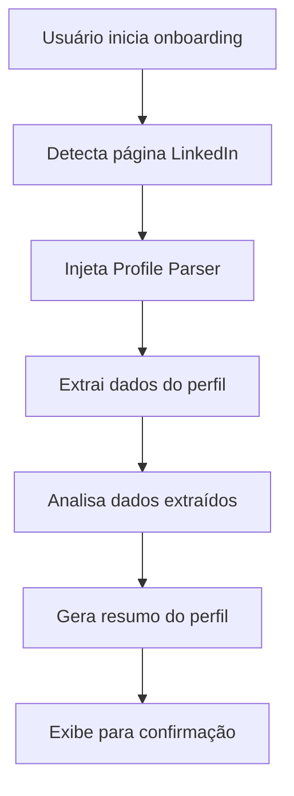
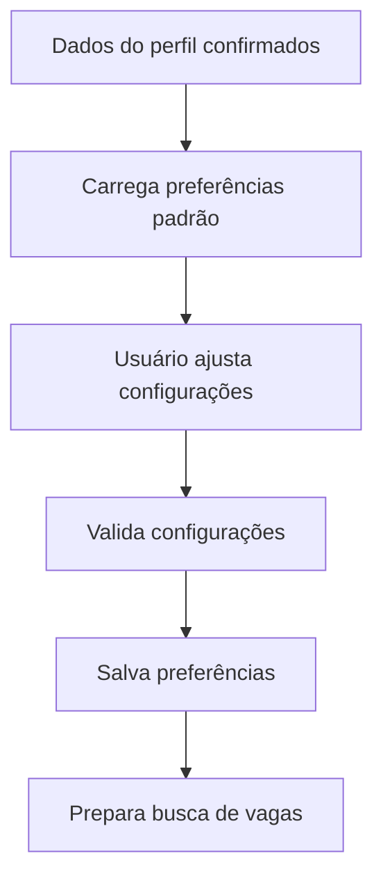
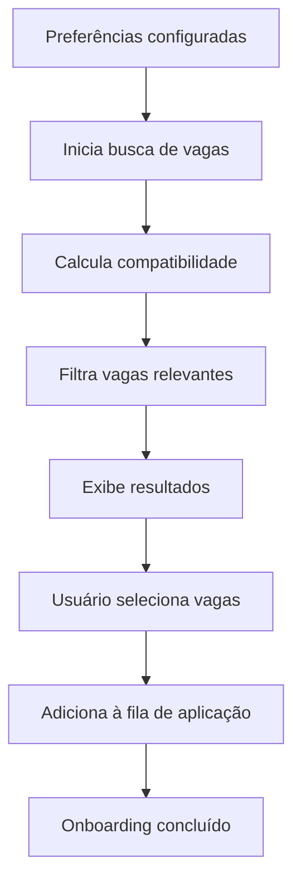

# Sistema de Onboarding WorkIn

## 📋 Visão Geral

O Sistema de Onboarding do WorkIn é uma solução inteligente que automatiza a configuração inicial da extensão, realizando varredura automática do perfil LinkedIn do usuário e configurando o sistema para candidaturas automáticas otimizadas.

## 🎯 Objetivos

1. **Configuração Automática**: Extrair dados do perfil LinkedIn automaticamente
2. **Análise Inteligente**: Analisar experiência, skills e senioridade do usuário
3. **Sugestões Personalizadas**: Recomendar vagas compatíveis com o perfil
4. **Aplicação Imediata**: Iniciar candidaturas automáticas para vagas relevantes
5. **Experiência Intuitiva**: Processo simples em 3 etapas

## 🏗️ Arquitetura do Sistema

### Componentes Principais

#### 1. LinkedIn Profile Parser (`content/linkedin-profile-parser.js`)
- **Função**: Extrai dados do perfil LinkedIn
- **Dados Extraídos**:
  - Informações básicas (nome, headline, localização, resumo)
  - Experiências profissionais (cargo, empresa, duração, descrição)
  - Educação (instituição, curso, período)
  - Skills e competências
  - Idiomas

#### 2. Profile Analyzer (`background/profile-analyzer.js`)
- **Função**: Analisa e processa dados do perfil
- **Análises Realizadas**:
  - Cálculo de senioridade baseado em experiência
  - Identificação de área principal de atuação
  - Extração de skills relevantes
  - Recomendações de carreira
  - Score de completude do perfil

#### 3. Job Search Engine (`background/job-search-engine.js`)
- **Função**: Busca vagas compatíveis automaticamente
- **Funcionalidades**:
  - Busca baseada em perfil e preferências
  - Cálculo de score de compatibilidade
  - Filtragem por critérios específicos
  - Busca periódica automática

#### 4. Auto Application System (`background/auto-application-system.js`)
- **Função**: Gerencia aplicações automáticas
- **Recursos**:
  - Fila de candidaturas inteligente
  - Rate limiting para segurança
  - Tentativas automáticas com fallback
  - Logging detalhado de atividades

#### 5. Onboarding Wizard (`onboarding/`)
- **Função**: Interface de configuração em 3 etapas
- **Etapas**:
  1. **Escaneamento de Perfil**: Extração automática de dados
  2. **Configuração de Preferências**: Ajustes personalizados
  3. **Descoberta de Vagas**: Busca e configuração inicial

## 🔄 Fluxo do Onboarding

### Etapa 1: Escaneamento de Perfil


### Etapa 2: Configuração de Preferências


### Etapa 3: Descoberta de Vagas


## 📊 Dados Processados

### Perfil LinkedIn
```javascript
{
  basicInfo: {
    name: "Nome do usuário",
    headline: "Título profissional",
    location: "Localização",
    summary: "Resumo profissional"
  },
  experience: [
    {
      title: "Cargo",
      company: "Empresa",
      duration: "Período",
      description: "Descrição das atividades"
    }
  ],
  education: [
    {
      institution: "Instituição",
      degree: "Curso",
      duration: "Período"
    }
  ],
  skills: ["Skill1", "Skill2", ...],
  languages: [
    {
      name: "Idioma",
      level: "Nível"
    }
  ]
}
```

### Análise de Perfil
```javascript
{
  professionalProfile: {
    seniority: "Junior|Mid|Senior|Lead",
    primaryArea: "Área principal",
    yearsOfExperience: 5,
    keySkills: ["Skills principais"],
    preferredLocation: "Localização preferida"
  },
  jobRecommendations: {
    recommendedRoles: ["Cargos recomendados"],
    targetCompanies: ["Empresas alvo"],
    salaryRange: "Faixa salarial"
  },
  profileCompleteness: {
    score: 85,
    missingElements: ["Elementos faltantes"],
    suggestions: ["Sugestões de melhoria"]
  }
}
```

## ⚙️ Configurações

### Preferências de Busca
- **Keywords**: Palavras-chave relevantes
- **Locations**: Localizações preferidas
- **Experience Level**: Nível de senioridade
- **Job Types**: Tipos de vaga (CLT, PJ, etc.)
- **Remote Preference**: Preferência por trabalho remoto

### Configurações de Aplicação
- **Auto Apply Enabled**: Ativar aplicação automática
- **Max Applications**: Máximo de candidaturas por dia
- **Min Score**: Score mínimo de compatibilidade
- **Easy Apply Only**: Apenas vagas com Easy Apply

### Notificações
- **New Jobs Found**: Novas vagas encontradas
- **Application Sent**: Candidatura enviada
- **Daily Summary**: Resumo diário
- **Weekly Report**: Relatório semanal

## 🔒 Segurança e Privacidade

### Proteção de Dados
- **Armazenamento Local**: Dados salvos apenas localmente
- **Criptografia**: Informações sensíveis criptografadas
- **Consentimento**: Permissão explícita para cada etapa
- **Controle**: Usuário pode revisar antes da aplicação

### Rate Limiting
- **Delay entre aplicações**: 30 segundos mínimo
- **Limite diário**: Máximo 20 candidaturas/dia
- **Limite por hora**: Máximo 5 candidaturas/hora
- **Detecção de bloqueios**: Pausa automática se detectado

## 🧪 Testes

### Teste Automatizado
Execute o teste completo do sistema:
```bash
node test-onboarding.js
```

### Cenários de Teste
1. **Extração de Perfil**: Verifica se todos os dados são extraídos
2. **Análise de Dados**: Valida cálculos de senioridade e skills
3. **Busca de Vagas**: Testa compatibilidade e filtragem
4. **Aplicação Automática**: Simula processo de candidatura

### Resultados Esperados
- ✅ Perfil extraído com sucesso
- ✅ Senioridade calculada corretamente
- ✅ Vagas compatíveis encontradas
- ✅ Candidaturas processadas automaticamente

## 📈 Métricas e Analytics

### Métricas Coletadas
- **Profile Completeness**: Score de completude do perfil
- **Job Match Rate**: Taxa de compatibilidade com vagas
- **Application Success Rate**: Taxa de sucesso das candidaturas
- **Time to First Application**: Tempo até primeira candidatura

### Relatórios
- **Daily Summary**: Resumo diário de atividades
- **Weekly Report**: Relatório semanal de performance
- **Monthly Analytics**: Análise mensal de tendências

## 🚀 Próximos Passos

### Melhorias Planejadas
1. **Machine Learning**: Algoritmos de recomendação mais avançados
2. **Integração com APIs**: Conexão com outras plataformas de emprego
3. **Análise de Mercado**: Insights sobre tendências do mercado
4. **Personalização Avançada**: Configurações mais granulares

### Roadmap
- **v1.1**: Melhorias na análise de perfil
- **v1.2**: Integração com Indeed e outras plataformas
- **v1.3**: Dashboard analytics avançado
- **v2.0**: Sistema de recomendações com IA

## 📞 Suporte

### Troubleshooting
1. **Perfil não detectado**: Verificar se está na página correta do LinkedIn
2. **Dados incompletos**: Revisar perfil LinkedIn e completar informações
3. **Vagas não encontradas**: Ajustar critérios de busca
4. **Aplicações falhando**: Verificar rate limits e conectividade

### Logs e Debug
- Logs detalhados disponíveis no console do navegador
- Arquivo de teste para validação de funcionalidades
- Sistema de notificações para feedback em tempo real

---

**Versão**: 1.0.0  
**Última Atualização**: Janeiro 2024  
**Responsável**: Equipe WorkIn